# Crowd Pressure Simulation in a Supermarket

Agent-based crowd simulation for analysing customer movement, congestion and queue formation in a supermarket. The project models how shop layout, aisle width, cash-register availability and customer density affect shopping time, local crowd pressure and overall store throughput.

The simulation was created as an experimental tool for testing shop layouts without running expensive and difficult real-world experiments in an actual supermarket.

## Project idea

The main goal is to reproduce the movement of customers inside a retail space and measure where bottlenecks appear. Each customer is represented as an autonomous agent that enters the shop, follows a shopping route, avoids obstacles and other customers, joins a checkout queue and finally leaves the store.

The project combines:

- **Social Force Model** for continuous pedestrian movement and collision avoidance;
- **A\*** pathfinding on a grid map for route planning between products, checkout zones and exits;
- **queue logic** for assigning customers to cash registers;
- **configurable store layouts** with shelves, walls, entrances, exits, pallets and checkout areas;
- **statistics module** for collecting shopping times, queue lengths, density maps and hotspot information;
- **real-time HUD** with charts and heatmap overlays.

## Demonstration

### Main simulation view

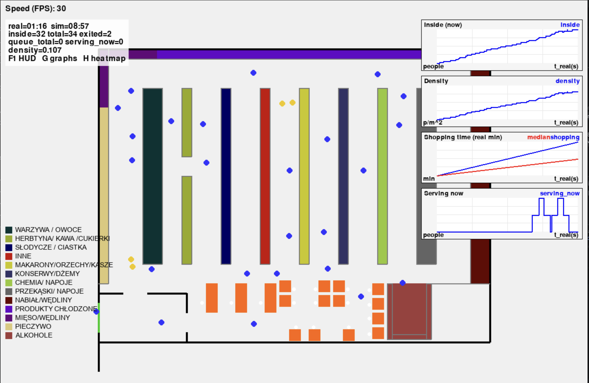

The main interface shows the supermarket layout, moving agents, active checkout queues, current simulation speed and real-time statistics. The HUD can display the number of customers inside the store, queue metrics, charts and hotspot information.

### Crowd pressure heatmap

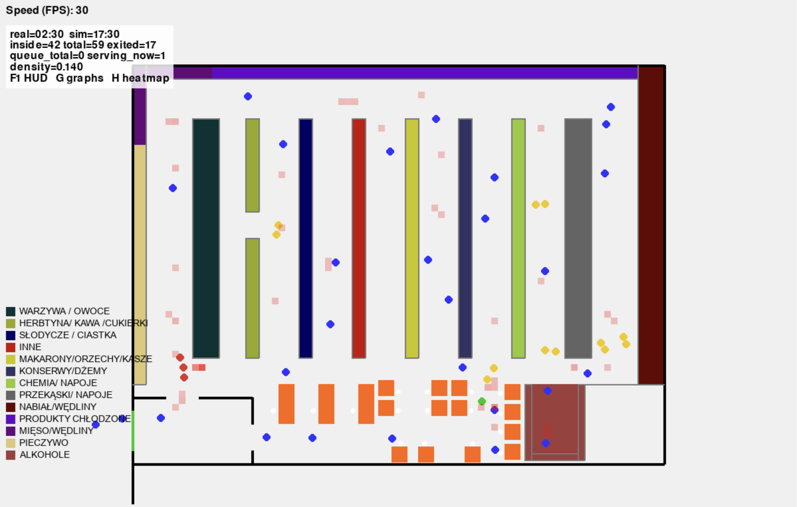

The heatmap overlay highlights zones where agents spend the most time or where local density is the highest. This makes it possible to detect bottlenecks near shelves, aisles and checkout zones.

### Clean simulation view

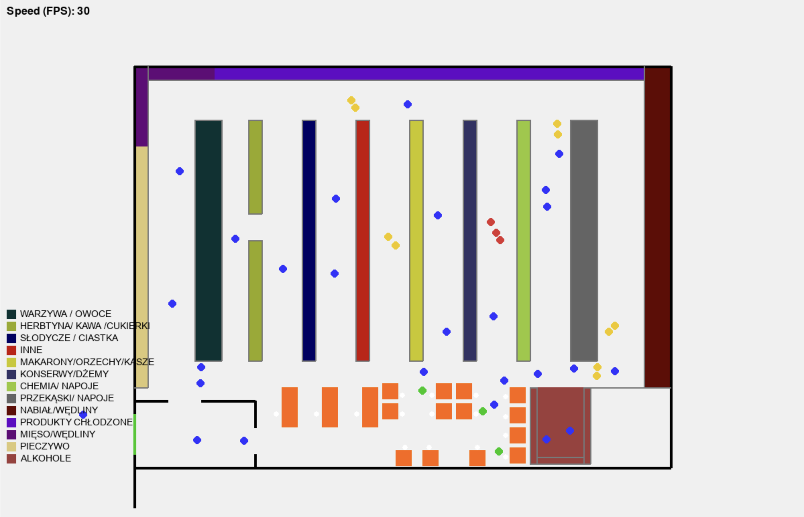

The simulation can also be viewed without analytical overlays, which makes it easier to observe the movement of agents, shopping paths and queue behaviour.

## Implemented functionality

- Real-time 2D supermarket simulation using `pygame`.
- Agent movement based on Social Force Model.
- Path planning with A* and path simplification.
- Configurable supermarket layouts through `Config*.py` files.
- Dynamic customer generation and removal.
- Product-zone visiting logic.
- Cash-register assignment and checkout queues.
- Visualisation of agents, shelves, cash registers, doors, pallets and paths.
- Live HUD with statistics and charts.
- Heatmap generation for crowded areas.
- CSV export of simulation statistics.
- Post-run analysis scripts for plots and comparison with observed data.

## Architecture

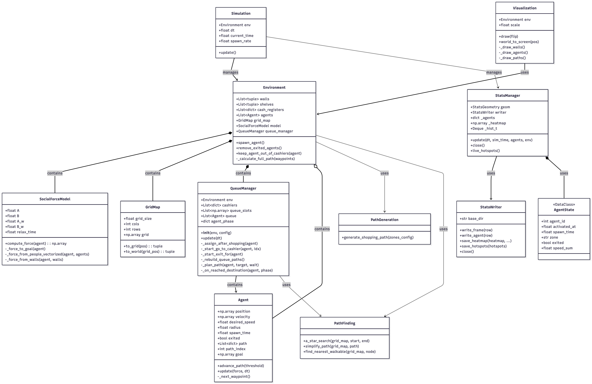

Main modules:

| File | Responsibility |
| --- | --- |
| `main.py` | Application entry point, event loop, HUD control and simulation update loop. |
| `Agent.py` | Customer agent state, movement, path following and physical properties. |
| `Environment.py` | Store geometry, spawning agents, exits, shelves and checkout zones. |
| `Simulation.py` | Main simulation step and integration of movement, queues and statistics. |
| `SocialForceModel.py` | Forces responsible for goal seeking, avoiding people and avoiding walls. |
| `PathFinding.py` | Grid map, A* search, line-of-sight checks and path simplification. |
| `QueueManager.py` | Queue assignment, checkout service logic and rebuilding queue paths. |
| `Visualization.py` | Rendering of store layout, agents, paths, queues and legend. |
| `stats/` | Statistics collection, HUD overlays, heatmaps, plots and CSV writing. |

## Simulation scenarios

The report includes several experimental scenarios used to validate and compare different store configurations.

### Scenario 1 — lower customer density

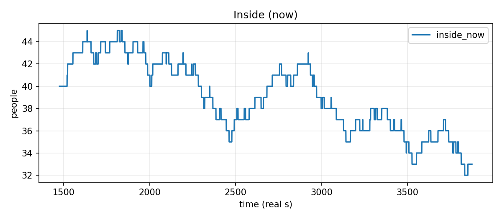

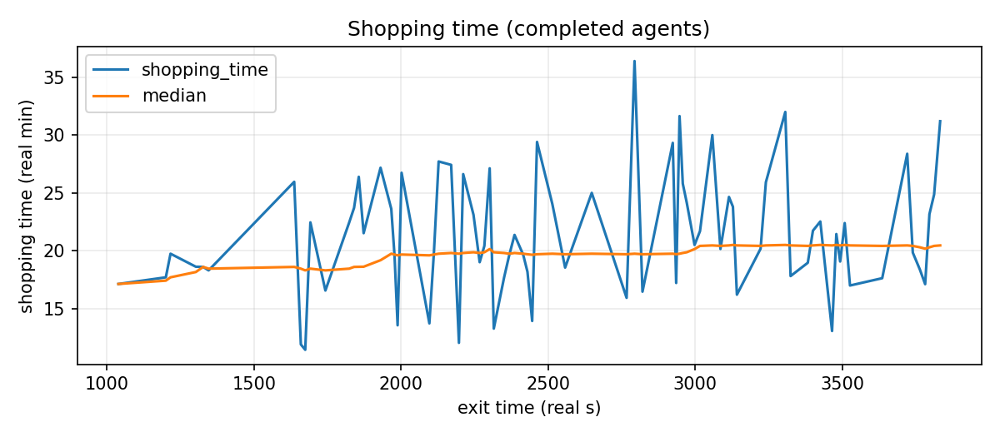

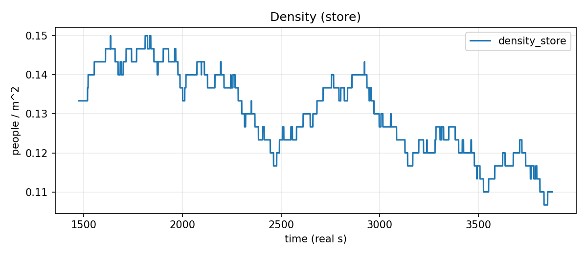

This scenario represents conditions outside peak hours. It is used as a baseline for lower density movement and shorter queues.

### Scenario 2 — peak-hour conditions

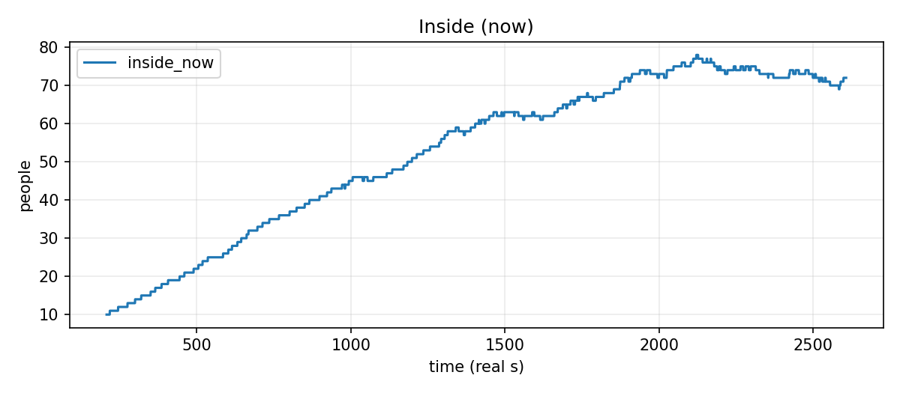

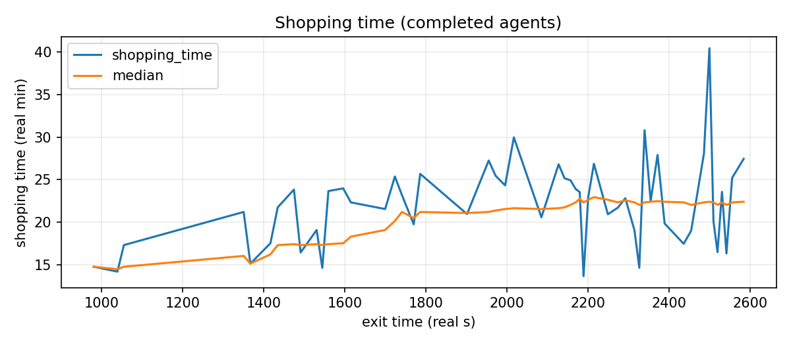

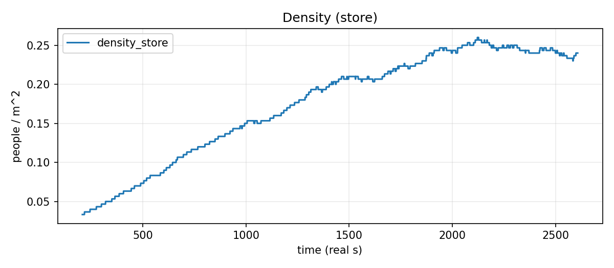

The peak-hour scenario was calibrated against real observations. The simulation reproduced the approximate number of customers in the store and the average shopping time with only a small percentage difference.

### Scenario 3 — additional passages between aisles

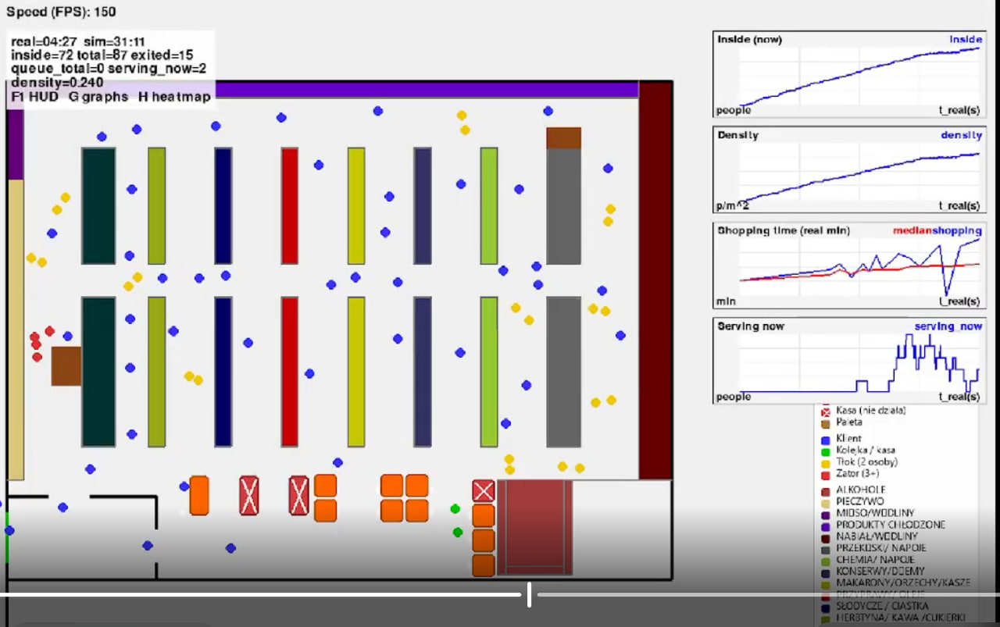

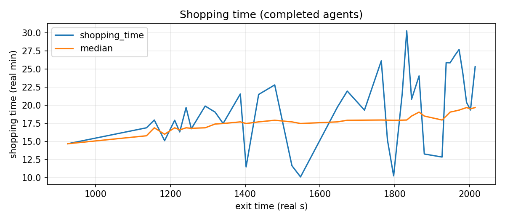

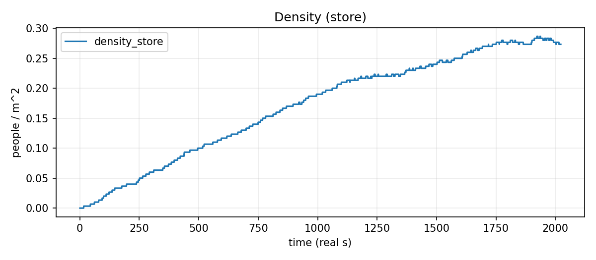

Adding cross-passages between aisles improves movement flow. In the experiment, the median shopping time decreased compared with the peak-hour baseline because agents could avoid congested aisles and take shorter paths.

### Scenario 4 — only three active cash registers

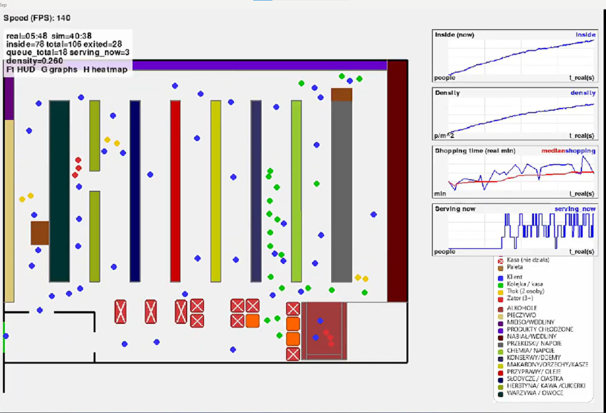

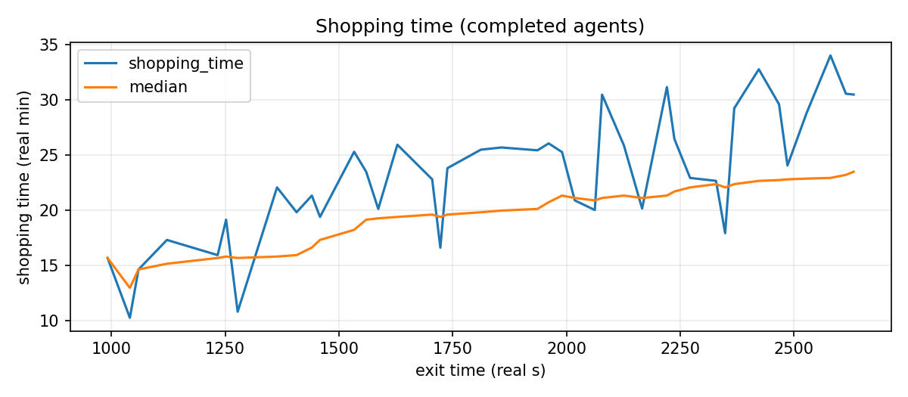

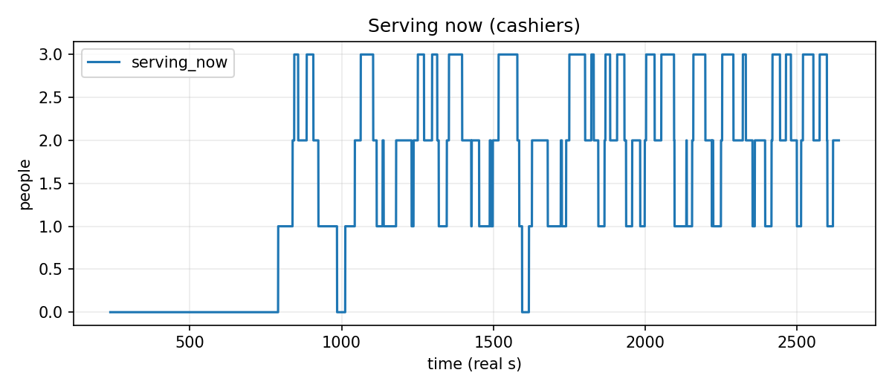

Reducing the number of active cash registers increases queue time and creates a bottleneck in the checkout zone. This scenario shows how checkout capacity can dominate total shopping time during high customer density.

## Results and observations

The simulation shows that store layout has a direct influence on customer flow. The baseline peak-hour configuration reproduced real measurements with a small error, which suggests that the model is useful for what-if analysis.

Key observations:

- additional passages between aisles reduced congestion and shortened shopping time;
- fewer active cash registers increased queue length and total time in the store;
- heatmaps clearly identified hotspots and dead zones;
- the checkout area can become the main throughput limitation;
- agent-based simulation can support layout design before physical changes are made in a real shop.

## Installation

The project was prepared for Python. Create a virtual environment and install dependencies:

```bash
python3 -m venv venv
source venv/bin/activate
pip install -r requirements.txt
```

On Windows:

```bash
python -m venv venv
venv\Scripts\activate
pip install -r requirements.txt
```

## Running the simulation

```bash
python3 main.py
```

or on Windows:

```bash
python main.py
```

By default, `main.py` imports `CONFIG` from `Config4.py`:

```python
from Config4 import CONFIG
```

To run another layout or scenario, change this import to one of the other configuration files, for example:

```python
from Config2 import CONFIG
```

## Controls

| Key | Action |
| --- | --- |
| `Space` | Pause or resume simulation. |
| `Esc` | Close the simulation. |
| `+` / `-` | Increase or decrease target FPS. |
| `F1`, `G`, `H` | Toggle HUD, charts and heatmap overlays. |

## Statistics output

After running the simulation, statistics are saved by the `stats` module. The project can export CSV data and generate plots for:

- number of people inside the shop;
- shopping time;
- queue length;
- density / heatmap values;
- hotspot zones;
- comparison with real observation data.

Additional analysis can be run with:

```bash
python3 analyze_stats.py
```

## Project limitations

The model is intentionally simplified. Customer decisions are partly random, all agents use similar behavioural rules, and the validation data comes from a limited number of observations. The real-time simulation is designed for dozens of agents, not thousands. Despite these limitations, it is sufficient for comparing layouts and identifying congestion-prone areas.

## Possible future development

- More detailed customer profiles and shopping strategies.
- More realistic reaction to promotions and blocked aisles.
- Larger and more complex supermarket layouts.
- Staff movement and pallet transport simulation.
- Cashier and self-checkout assistance modelling.
- Support for larger crowds with further performance optimisation.
